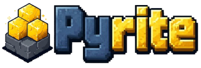

<div align="center">
  
  <br>
  <a href="https://github.com/ShivamKR12/Pyrite/actions/workflows/build.yml"></a>
  <a href="https://github.com/ShivamKR12/Pyrite/actions/workflows/test.yml"></a>
  <a href="https://github.com/ShivamKR12/Pyrite/actions/workflows/ruff.yml"></a>
  <a href="https://github.com/ShivamKR12/Pyrite/actions/workflows/mypy.yml"></a>
  <a href="https://github.com/ShivamKR12/Pyrite/actions/workflows/pylint.yml"></a>
  <a href="https://github.com/ShivamKR12/Pyrite/actions/workflows/glsl_validate.yml"></a>
  <a href="https://github.com/ShivamKR12/Pyrite/actions/workflows/mutation.yml"></a>
  <a href="https://github.com/ShivamKR12/Pyrite/actions/workflows/docs.yml"></a>
  <a href="https://github.com/ShivamKR12/Pyrite/releases/latest"></a>
</div>

# Pyrite

Pyrite is a highly-optimized, procedural 3D Voxel Engine written entirely in Python.

## Features
### 🚀 Insane Engine Performance
- **Numba LLVM JIT Compilation:** Bypasses the Python GIL using `nogil=True`, `fastmath=True`, and `parallel=True` to run chunk generation, vectorized noise math, and frustum culling across all CPU cores at near C++ speeds.
- **True Asynchronous Loading:** Utilizes `ThreadPoolExecutor` to load SQLite databases and generate terrain entirely in the background, keeping the Pygame main thread stutter-free.
- **Advanced Rendering Pipeline:** Combines **Greedy Meshing** (to drastically reduce GPU draw calls), **Vectorized Frustum Culling**, and **Hardware Occlusion Queries** via ModernGL to ensure the GPU only draws what the player can actually see.
- **Volumetric BFS Lighting Engine:** A highly optimized Breadth-First Search lighting system using 64-bit integer bit-packing and fast 1D array paths for ultra-fast, real-time sunlight and block-light propagation.

### 🌍 Deep World Management & Generation
- **Infinite Procedural Terrain:** Uses 3D Simplex noise to generate height-based biomes, complete with deep sprawling caves, dynamic dirt depth, and natural tree placements.
- **Dynamic Seeding:** MD5 string-hashing allows players to input custom text seeds to deterministically generate unique worlds.
- **SQLite Disk Storage:** Worlds are saved using SQLite Write-Ahead Logging (WAL) for async-like high-performance disk writing. `lightmap` arrays, player XYZ coordinates, and full inventories are cached to completely skip expensive recalculations on load!

### ⛏️ Complete Survival Mechanics
- **Progression & Crafting:** A fully interactive 36-slot inventory, hotbar, and 2x2 crafting grid with drag-and-drop UI. Features a tool dependency system (e.g., Wooden Pickaxes mine stone 5x faster).
- **Survival Stats:** Dynamic health, hunger, and oxygen mechanics. Features fall damage, drowning, void death, and a smart spawn system to prevent spawning underwater.
- **3D Physics & Audio:** Mined blocks drop as physically simulated, rotating 3D entities. Features block-specific stereo audio (footsteps, breaking, placing) and C418 background music.

### 🌅 Atmospheric Visuals
- **Dynamic Day/Night Cycle:** The sun, moon, and twinkling stars rotate through the sky, dynamically altering ambient lighting, sunset fog colors, and shadow intensity.
- **Volumetric Fluids & Custom Fog:** Fully 3D flowing water blocks, underwater screen-tinting, and density-scaled fog that seamlessly hides chunk boundaries.
- **Custom OBJ Parsing:** Parses raw `.obj` files and `.mtl` colors directly in Python to render custom 3D tool models (sticks, pickaxes) in-hand.

## Controls
| Key / Input | Action |
| :--- | :--- |
| **W A S D** | Move |
| **Space** | Jump / Swim up |
| **L-Shift** | Sprint / Move down (Creative) |
| **Mouse** | Look around |
| **Left Click** | Mine / Break block |
| **Right Click** | Place block |
| **E** | Open Inventory / Crafting |
| **F** | Toggle Creative / Survival mode |
| **1 - 9** | Select Hotbar slot |
| **Scroll Wheel** | Cycle Hotbar slot |
| **P** | Toggle Wireframe view |
| **O** | Toggle Frustum Culling (Debug) |
| **F3** | Toggle Debug Overlay |
| **ESC** | Pause Game / Menu |

## Run from Source

It is highly recommended to use a Python Virtual Environment (`venv`) to install Pyrite's dependencies, so you don't mess up your system-wide Python packages.

### Windows
```cmd
python -m venv venv
venv\Scripts\activate
pip install -r requirements.txt
python run.py
```

### Linux
```bash
python3 -m venv venv
source venv/bin/activate
pip install -r requirements.txt
python3 run.py
```

### macOS
```bash
python3 -m venv venv
source venv/bin/activate
pip install -r requirements.txt
python3 run.py
```

## Running Tests
To ensure the engine's core mechanics (like transparent block rendering and lighting logic) are working correctly, you can run the test suite locally using `pytest`:

```bash
# Ensure your virtual environment is activated, then install pytest if you haven't already:
pip install pytest

# Run the entire test suite:
pytest tests/
```
