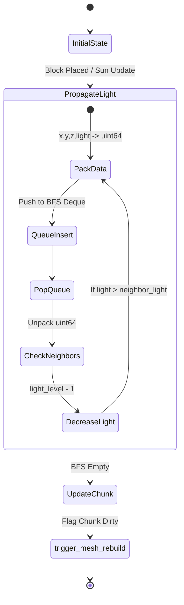
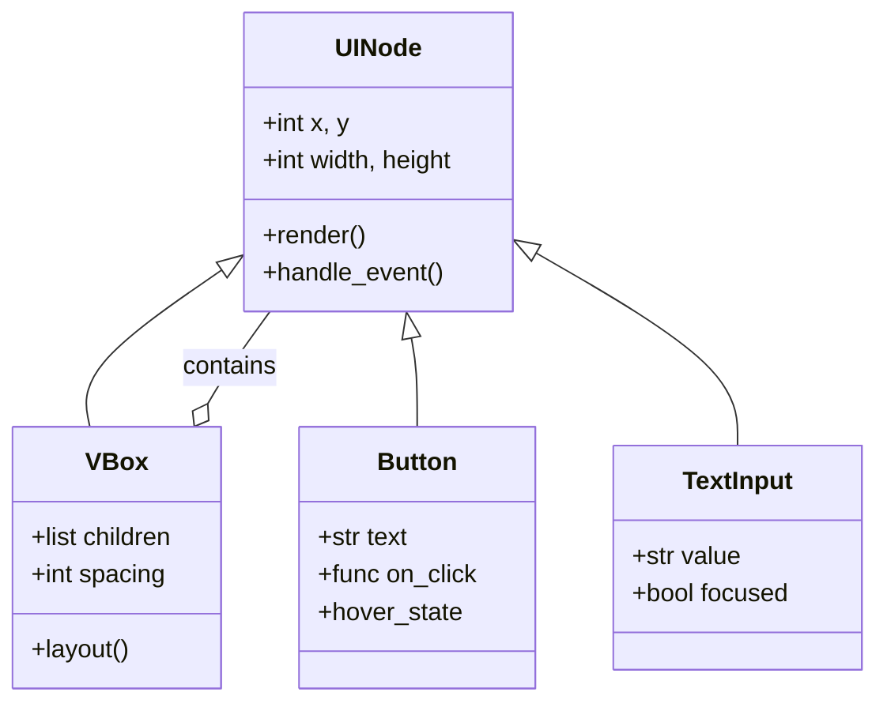

# Pyrite Engine Architecture

This document provides high-level architectural blueprints for the Pyrite Voxel Engine. It is intended to be used by both human developers and AI subagents to understand the complex async logic, rendering pipelines, and UI hierarchies without hallucinating.

## 1. World Generation & Meshing Pipeline (Async Data Flow)

Pyrite utilizes a strictly thread-safe architecture where heavy computations (Numba JIT terrain generation, Greedy Meshing) happen on background threads, and only the main thread interacts with the OpenGL context.

```mermaid
flowchart TD
    subgraph Main Thread (OpenGL Context)
        W[World Class] -->|1. Request Chunks| Executor[ThreadPoolExecutor]
        MQ[mesh_queue] -->|4. process_mesh_queue| VAO[Assign VBO/VAO]
        LQ[load_queue] -->|process_load_queue| State[Update Game State]
        VAO -->|5. Render| Shader[chunk.frag / chunk.vert]
    end

    subgraph Background Workers (CPU Intensive)
        Executor -->|2. fetch_or_generate_voxels| Gen[Terrain Generation]
        Gen --> |3a. Result| LQ
        Executor -->|2. build_chunk_mesh| Mesh[Greedy Mesher]
        Mesh -->|3b. Vertex Data| MQ
    end
```

## 2. Numba BFS Lighting State Machine

Lighting is one of the most computationally expensive operations in a voxel engine. Pyrite utilizes Numba to release the GIL (`nogil=True`) and aggressively pack coordinates and light values into 64-bit integers.



## 3. UI Hierarchy & Component Graph

The native Pyrite UI system is built on a composable tree of Python objects that eventually render via `ui_*.frag` shaders.



*Note to AI Agents: When generating new UI screens, use the `VBox` and `Button` instantiations mapped out in this class diagram.*
